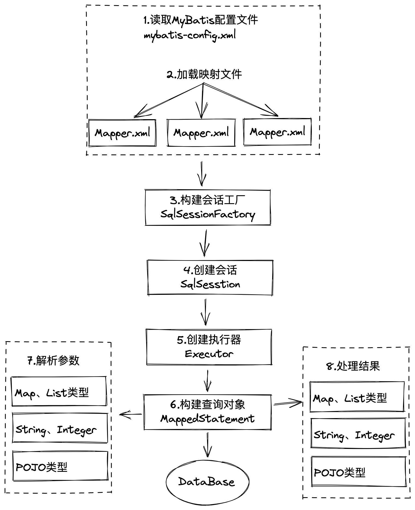

# MyBatis
## MyBatis 拦截器
MyBatis允许使用插件拦截的方法包括：  
1. Executor (update, query, flushStatements, commit, rollback, getTransaction, close, isColsed)  
2. ParameterHandler (getParameterObjects, setParameters)  
3. ResultSetHandler (handleResultSets, handleOutputParameters)  
4. StatementHandler (prepare, parameterize, batch, update, query)  

## MyBatis 分页原理
对 StatementHandler进行拦截，注入分页参数

## MyBatis 二级缓存
https://www.cnblogs.com/cxuanBlog/p/11333021.html
## MyBatis 执行流程

1. 读取核心配置：数据库链接、类型别名、类型处理器等。将核心配置封装成一个Configuration对象。  
2. 加载映射文件。可以通过配置文件和package扫描的方式加载Mapper  
3. 使用构造者模式，SqlSessionFactoryBuilder构建SqlSessionFactory  
4. 创建回话对象SqlSession, 该对象包含了执行SQL的所有方法。该对象不是线程安全的，因此不能被共享，使用完毕之后需要colse  
5. Executor执行器。负责SQL语句的生成和查询缓存的维护  
- SimpleExecutor 普通的执行器  
- ReuseExecutor 使用缓存的执行器  
- BathcExecutor 批量执行器  
 6. MappedStatement是对解析的SQL语句进行封装，一个MappedStatement就是一条SQL  
 7. 处理参数，将参数映射成parameterType和parameterMap。
 8. 封装查询的结果  